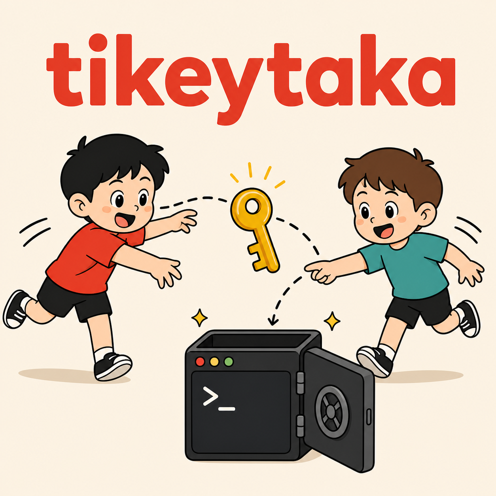

[English](README.md) | [한국어](README.ko.md) | 日本語 | [Español](README.es.md) | [中文](README.zh.md)

# tikeytaka

<p align="center">
  
</p>

APIキー中央ボールトプラグイン — 散らばった `.env` のキーを1つの暗号化ボールトに集約し、チャットにキーを晒さず登録、1回の更新を全プロジェクトへ伝播します。AIとティキタカしている間、キーは自動で照会・接続されます。

## Quick Start

### 1. マーケットプレイスを追加

```
/plugin marketplace add https://github.com/fivetaku/gptaku_plugins.git
```

### 2. インストール

```
/plugin install tikeytaka
```

### 3. Claude Code を再起動

（新しいコマンドは再起動後に登録されます。）

### 4. 実行

```
/tikeytaka
```

その後、自分のターミナルで `bash <プラグインパス>/bin/tkt init` を1回実行し（正確なパスはコマンドが案内します）、`/tikeytaka:scan` で既存キーを統合してください。

## なぜ tikeytaka か

実際のホームディレクトリのスキャンで **45個の `.env`** が見つかり、同じキーが6ファイルに3種類の異なる値で存在、その多くは失効済みでした。散在するキーはローテーションも失効もできず、何を持っているかさえ分かりません。tikeytaka は暗号化ファイル1つを正本にし、すべての `.env` を機械が更新するコピーに変えます。

- **登録不要**: すでに使っているクラウドフォルダ（iCloud Drive / Google Drive / OneDrive / Dropbox）を自動検出し、暗号化ファイル1つを同期。なければローカル単一デバイスモード。選択パスは固定され、勝手に切り替わりません。
- **構造的に安全**: AES-256-CBC + PBKDF2（60万回・SHA-256）+ 内蔵整合性ハッシュ（TKT2形式）。破損・同期未完了ファイルは検知して即停止し、**原本を絶対に上書きせず**、変更前に `.bak` を1世代保存します。
- **OS統合**: 復号パスフレーズは macOS キーチェーン / Linux secret-tool / Windows DPAPI に保管。いずれも無い場合のみ明示的同意（`TKT_ALLOW_FILE_FALLBACK=1`）で 0600 ファイルにフォールバック。
- **露出最小化**: キー値はターミナルの非表示入力（`tkt setp`）または stdin（`set-stdin`）のみで受け取り、チャット・シェル履歴・プロセス一覧（argv）に残しません。

## 仕組み

```
ユーザー / Claude  ──►  bin/tkt（単一 bash CLI）
                         ├── secrets.enc   暗号化ボールト — クラウドフォルダ経由で移動
                         ├── OSキーチェーン  マスターパスフレーズ1つ — デバイス外に出ない
                         └── map.tsv       デバイスローカル配線 — どの .env にどのキー
```

クラウドを流れるのは常に暗号文だけで、開く鍵はデバイスを離れません。`tkt sync` は1回復号して整合性を検証し、マッピングされた全 `.env` をファイル権限を保持したまま更新します。

## コマンド

| コマンド | 機能 |
|---|---|
| `/tikeytaka` | 状態サマリー（キー数、ボールト位置、未伝播） |
| `/tikeytaka:use` | **キーが必要な作業でまずボールトを確認 → 自動接続・テスト**（質問しない） |
| `/tikeytaka:scan` | 既存プロジェクトの .env を探索 → キー統合登録 + 接続（失効キーの実測検証付き） |
| `/tikeytaka:add` | 新しいキーをチャット露出なしで登録 |
| `/tikeytaka:list` | 管理中サービス・プロジェクト接続状況 |
| `/tikeytaka:sync` | ボールト → 接続された全 .env へ伝播 |

## 新しいデバイスの接続

1. クラウドフォルダの同期を待つ（ボールトファイル到着）
2. `bash <プラグインパス>/bin/tkt init` — 同じボールトパスフレーズを入力
3. プロジェクト接続はデバイスごと: `/tikeytaka:scan`（または `tkt map-add`）でこのデバイスの .env を配線（`map.tsv` は設計上デバイスローカル）
4. `tkt sync`

## 要件

- `bash`, `openssl`（macOS・Linux・Git for Windows に同梱 — Claude Code の Windows シェルは Git Bash）
- シークレットストア: macOS キーチェーン / Linux `secret-tool` / Windows PowerShell（DPAPI）

| プラットフォーム | 状態 |
|---|---|
| macOS（キーチェーン + iCloud等） | 検証済み |
| Windows（Git Bash + OneDrive/Google Drive + DPAPI） | 実装済み・暫定 |
| Linux（secret-tool + Dropbox または `TIKEYTAKA_DIR` 手動指定） | 実装済み・暫定 |

## 既知の制限（正直な開示）

- **同時編集不可**: 2台のデバイスから同時に `set`/`del` すると、片方が競合検知で停止します（データは安全）。個人利用前提。
- macOS キーチェーン登録（`security -w`）は init の1回だけパスフレーズがプロセス引数を通ります — ツールの制約。
- これは個人用ボールトです。チーム共有・権限分離・監査ログが必要なら、シークレット SaaS（例: Infisical）をご利用ください。
- すでに侵害されたアカウント（キーロガー等）はいかなるローカルボールトでも保護できません。

## ソース

https://github.com/fivetaku/tikeytaka — [gptaku-plugins](https://github.com/fivetaku/gptaku_plugins) マーケットプレイス所属。

## ライセンス

[MIT](./LICENSE) — [DISCLAIMER.md](./DISCLAIMER.md) も参照。
